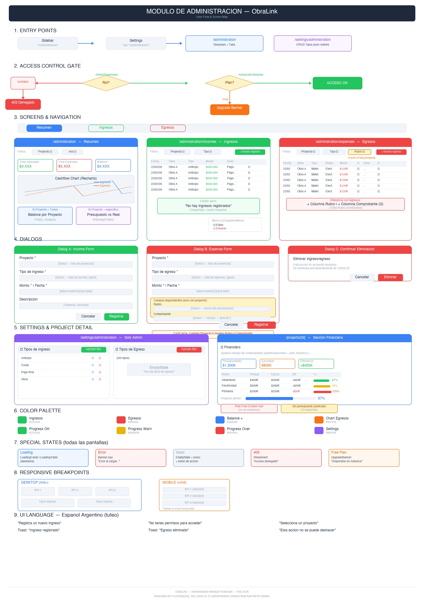

# Administration Module — Flowchart & UI Spec

> **Feature:** Modulo de Administracion (Ingresos & Egresos)
> **Fecha:** 2026-02-22
> **Para:** Designer — prototipos de UI
> **Diagrama visual:** ver `administration-flowchart.jpg` en este directorio



---

## 1. Entry Points

El modulo tiene 2 puntos de entrada:

| Desde | Destino | Quien lo ve |
|-------|---------|-------------|
| Sidebar → "Administracion" (icono Landmark) | `/administration` | Admin, Supervisor |
| Settings → tab "Administracion" | `/settings/administration` | Solo Admin |

---

## 2. Access Control Gate

Antes de renderizar cualquier pantalla, se evalua en orden:

```
Usuario llega al modulo
  │
  ├─ Rol = Architect → SCREEN: 403 "Acceso denegado" (EmptyState + ShieldAlert)
  │
  ├─ Plan = Free → SCREEN: UpgradeBanner "Disponible en plan Advance"
  │
  └─ Rol = Admin/Supervisor + Plan Advance/Enterprise → ACCESO OK
```

**Diferencia Admin vs Supervisor:**
- Admin: acceso completo + Settings/Administracion (CRUD tipos)
- Supervisor: puede ver y operar ingresos/egresos, NO ve Settings/Administracion

---

## 3. Pantallas

### 3.1 — Resumen (`/administration`)

**Layout:** PageHeader + Tabs (Resumen | Ingresos | Egresos)

**Contenido:**

1. **Filtros** — Select Proyecto (Todos / especifico) + Select Ano (2026, 2025, 2024)

2. **3 KPI Cards** (StatCard):
   - Total Ingresado (icono TrendingUp, verde)
   - Total Egresado (icono TrendingDown, rojo)
   - Balance (icono DollarSign, azul si positivo, rojo si negativo)

3. **Grafico Cashflow** (Recharts LineChart):
   - Eje X: 12 meses (Ene-Dic)
   - Linea azul: ingresos mensuales
   - Linea naranja: egresos mensuales
   - Tooltip con ambos valores + balance

4. **Tabla condicional:**
   - Si filtro = "Todos los proyectos" → **Balance por Proyecto** (tabla con proyecto, ingresos, egresos, balance con badge verde/rojo)
   - Si filtro = proyecto especifico → **Presupuesto vs Real** (VsBudgetTable, solo si hay presupuesto publicado)

**Estados:**
- Loading: LoadingCards(3) + LoadingCards(1)
- Error: Banner rojo
- Sin datos: StatCards muestran $0

---

### 3.2 — Ingresos (`/administration/incomes`)

**Layout:** Tabs (activo: Ingresos)

**Contenido:**

1. **Filtros** — Select Proyecto + Select Tipo de Ingreso + Boton "Nuevo ingreso" (alineado derecha)

2. **Tabla:**
   | Fecha | Obra | Tipo | Monto (right-align) | Descripcion (truncate) | ⋯ |
   |-------|------|------|---------------------|------------------------|---|

3. **Menu contextual** (⋯ → DropdownMenu): Editar, Eliminar

**Estados:**
- Loading: LoadingTable(6)
- Vacio: EmptyState "No hay ingresos registrados" + boton "Registrar ingreso"
- Error: Banner rojo

---

### 3.3 — Egresos (`/administration/expenses`)

**Layout:** Tabs (activo: Egresos)

**Contenido:**

1. **Filtros** — Select Proyecto + Select Tipo de Egreso + Select Rubro (solo visible si hay proyecto seleccionado) + Boton "Nuevo egreso"

2. **Tabla:**
   | Fecha | Obra | Tipo | Rubro | Monto | Comp. | Descripcion | ⋯ |
   |-------|------|------|-------|-------|-------|-------------|---|

   - Columna "Comp." muestra icono Paperclip si tiene receipt_id vinculado

3. **Menu contextual** (⋯ → DropdownMenu): Editar, Eliminar

**Estados:** iguales a Ingresos

---

### 3.4 — Settings/Administracion (`/settings/administration`)

**Acceso:** Solo admin. Supervisor/Architect ven "Acceso denegado".

**Layout:** Grid 2 columnas (md), 1 columna (mobile)

**Contenido:** 2 Cards lado a lado:

| Card izquierda | Card derecha |
|----------------|--------------|
| Tipos de Ingreso (ArrowDownCircle) | Tipos de Egreso (ArrowUpCircle) |
| Header con titulo + boton "Agregar tipo" | Idem |
| Tabla: Nombre + Acciones (Editar pencil, Eliminar trash) | Idem |

**Dialogs:**
- Agregar/Editar tipo: Input "Nombre" + Guardar/Cancelar
- Eliminar tipo: Confirmacion "Esta accion es irreversible"

**Estado vacio por card:** EmptyState "No hay tipos de ingreso/egreso" + boton "Agregar tipo"

---

### 3.5 — Seccion Financiera en Proyecto (`/projects/[id]`)

Aparece **debajo** de la tabla de comprobantes.

**Visibilidad:**
- Plan Free → no se renderiza (return null)
- Sin presupuesto publicado → EmptyState "Sin presupuesto publicado"
- Con presupuesto → VsBudgetTable

**VsBudgetTable contiene:**
1. 3 KPI cards mini: Presupuestado, Ejecutado, Diferencia
2. Tabla por rubro: Rubro | Presupuestado | Ejecutado | Diferencia | % (con progress bar)
3. Barra de progreso global al pie

**Colores de progress bars:**
- < 80% → verde
- 80-100% → amarillo
- > 100% → rojo (sobre-ejecutado)

---

## 4. Dialogs

### 4.1 — Income Form Dialog

```
Titulo: "Registrar ingreso" / "Editar ingreso"
Descripcion: "Registra un nuevo ingreso asociado a una obra"

Campos:
  - Proyecto *          [Select - lista de proyectos]
  - Tipo de ingreso *   [Select - lista de income_types]
  - Monto *             [Input number, step 0.01]     | Fecha *  [Input date]
  - Descripcion         [Textarea, opcional]

Acciones: [Cancelar] [Registrar/Actualizar]
```

### 4.2 — Expense Form Dialog

```
Titulo: "Registrar egreso" / "Editar egreso"
Descripcion: "Registra un nuevo egreso asociado a una obra"

Campos:
  - Proyecto *          [Select]
  - Tipo de egreso *    [Select]
  - Monto *             [Input number]  | Fecha *  [Input date]
  ── Campos dependientes (visibles cuando hay proyecto) ──
  - Rubro               [Select - rubros del presupuesto del proyecto]
  - Comprobante         [Select - receipts del proyecto, muestra "vendor — $monto"]
  ──
  - Descripcion         [Textarea, opcional]

Acciones: [Cancelar] [Registrar/Actualizar]

CASCADA: al cambiar Proyecto → se resetean Rubro y Comprobante
         y se recargan las opciones para el nuevo proyecto
```

### 4.3 — Delete Confirmation Dialog

```
Titulo: "Eliminar ingreso/egreso"
Descripcion: "Esta accion no se puede deshacer. Se eliminara
              permanentemente este ingreso/egreso de {Obra X}."

Acciones: [Cancelar] [Eliminar (destructive)]
Estado loading: "Eliminando..."
```

---

## 5. Paleta de colores semanticos

| Concepto | Color | Hex |
|----------|-------|-----|
| Ingresos (icono, badge) | Verde | `#22c55e` |
| Egresos (icono, badge) | Rojo | `#ef4444` |
| Balance positivo | Azul | `#3b82f6` |
| Balance negativo | Rojo | `#ef4444` |
| Chart linea ingresos | Azul | `#3b82f6` |
| Chart linea egresos | Naranja | `#f97316` |
| Progress bar < 80% | Verde | `#22c55e` |
| Progress bar 80-100% | Amarillo | `#eab308` |
| Progress bar > 100% | Rojo | `#ef4444` |

---

## 6. Responsive

| Componente | Desktop | Mobile |
|------------|---------|--------|
| KPI cards | 3 columnas | 1 columna stack |
| Settings types | 2 columnas grid | 1 columna stack |
| Tablas | completas | scroll horizontal |
| Filtros | inline row | wrap |
| Dialogs | max-w-lg centrado | full width |

---

## 7. UI Language

**Idioma:** Espanol argentino con tuteo.

Ejemplos:
- "Registra un nuevo ingreso" (no "Registre")
- "No tenes permisos" (no "No tienes")
- "Selecciona un proyecto" / "Ingresa el nombre"
- Toast: "Ingreso registrado", "Egreso eliminado", "Tipo actualizado"

---

## 8. Componentes existentes reutilizados

- `StatCard` — KPI cards con icono, titulo, valor
- `Card` — contenedor
- `Table` / `TableHeader` / `TableBody` / `TableRow` / `TableCell` — tablas
- `Dialog` / `DialogContent` / `DialogHeader` / `DialogFooter` — modales
- `Select` / `SelectContent` / `SelectItem` — dropdowns
- `Input` / `Textarea` / `Label` — form fields
- `Button` — botones (variantes: default, outline, destructive, ghost)
- `Badge` — etiquetas de estado
- `EmptyState` — estado vacio con icono + titulo + descripcion + accion
- `LoadingTable` / `LoadingCards` — skeletons
- `PageHeader` — titulo + descripcion + accion
- `UpgradeBanner` — banner de upgrade de plan
- `DropdownMenu` — menu contextual
